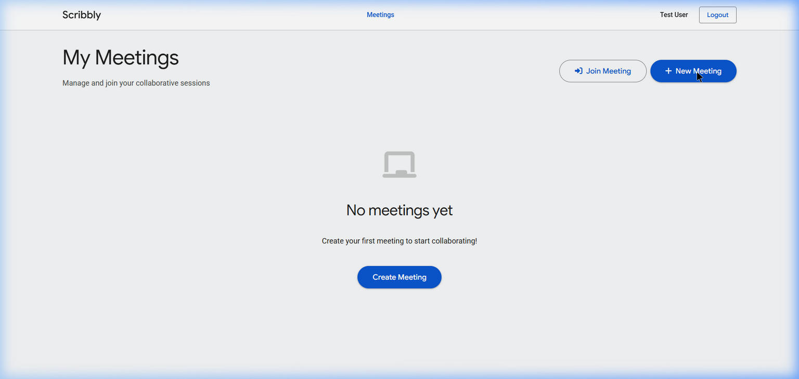
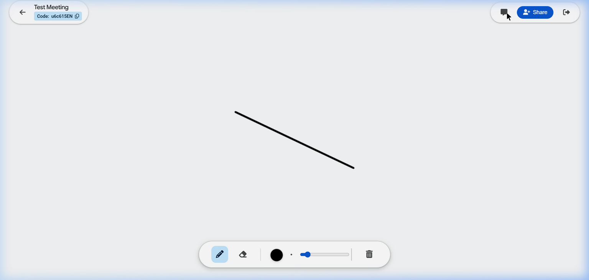

<div align="center">
  
  <h1>Scribbly 🎨</h1>
  <p><strong>A high-performance, real-time collaborative whiteboard platform built for seamless team ideation.</strong></p>

  <p>
    
    
    
    
    
  </p>
</div>

---

Scribbly is an advanced full-stack modern web application that enables teams to collaborate visually in real-time. Built around the **MEAN stack** and **Socket.IO**, it provides an incredibly low-latency, synchronized drawing canvas alongside integrated meetings and chat features.

## ✨ Key Features

- **⚡ Real-time Collaboration:** Drawing events are instantly synchronized across all connected peers using an optimized Socket.IO communication layer.
- **🎨 High-Performance Rendering:** We've decoupled canvas event listeners (`mousemove`, `touchmove`) from Angular’s `NgZone` and applied a ~10ms event throttle. The result is a buttery smooth 60fps experience that doesn't bottleneck the browser's main thread.
- **🔐 Secure Authentication Base:** Role-based access using JSON Web Tokens (JWT) for the REST APIs, paired with secure Socket.IO connection handling.
- **☁️ Cloud-Ready Stateless Backend:** Uploaded profiles and meeting thumbnail assets are automatically encoded as Base64 strings directly into the MongoDB document. This makes the backend fully stateless and compatible with severless/ephemeral environments like Render.
- **💬 Team Communication:** Persistent message histories with a live embedded group chat available on the side of every whiteboard.
- **💎 Modern UI/UX:** A frosted glassmorphism UI overlay, floating toolbars, responsive design, and intuitive UX modeled after Material Design 3 guidelines.

## 🖼️ Application Previews 

> **Developer Note:** Drop your actual application screenshots in the `screenshots/` directory to have them display here naturally!

| Dashboard & Meeting Management | Realtime Whiteboard & Chat |
| :---: | :---: |
|  |  |

---

## 🛠️ Tech Stack & Architecture

Scribbly embraces a robust **Client-Server architecture** designed to safely handle ephemeral and persistent data workloads optimally.

* **Frontend:** Angular 19 (Standalone Components, RxJS, SCSS Theming)
* **Backend:** Node.js, Express.js
* **Database:** MongoDB (using Mongoose ODM) with compound optimized queries
* **Real-time Pipeline:** Socket.IO v4

### How It Works:
1. **REST Protocol:** Ephemeral file buffers are cleanly managed in memory using `multer.memoryStorage()`, converted to `Base64` formats, and stored persistently in MongoDB collections.
2. **WebSocket Pipeline:** Short-lived granular events (cursor brush movements, color swaps) are transmitted bidirectionally without overloading the database or the HTTP transaction stack.

---

## 🚀 Getting Started Locally

Use the steps below to easily spin up Scribbly on your machine for local development or testing.

### Prerequisites
* [Node.js](https://nodejs.org/en) (v18+)
* [MongoDB](https://www.mongodb.com/try/download/community) installed locally or a free MongoDB Atlas URI.
* Angular CLI installed globally (`npm install -g @angular/cli`)

### 1. Backend Server Setup
Start the scalable REST and Socket server:
```bash
# Navigate to the backend directory
cd backend

# Install all backend dependencies
npm install

# (Optional) Create environment variable file if required
echo "MONGO_URI=mongodb://127.0.0.1:27017/IdeaBoard" > .env
echo "JWT_SECRET=super_secret_dev_key" >> .env
echo "FRONTEND_URL=http://localhost:4200" >> .env

# Start the dev server using nodemon
npm run dev 
# The console will display "Server running on port 5001" and "MongoDB Connected"
```

### 2. Frontend Application Setup
In a new terminal window, boot up the Angular user interface:
```bash
# Navigate to the frontend UI
cd ideaboard-client

# Install all Angular dependencies
npm install

# Start the Angular development engine
npm start
```
Once the compilation succeeds, pop open your browser and navigate to **`http://localhost:4200`** to log in and start using your Whiteboard!

---

## 📄 License
Distributed under the **MIT License**.

<div align="center">
  <sub>Built with ❤️ by Abhishek Nejkar</sub>
</div>
